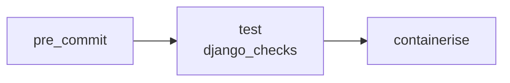

# testdjereo developer README

## Development prerequisites

In addition to the [Prerequisites](../README.md#prerequisites) listed in the main README
you will need the following to develop `testdjereo`:

- [pre-commit](https://pre-commit.com/)

## The djereo project template

`testdjereo` has been generated using the [djereo](https://github.com/albertomh/djereo)
project template.

To update `testdjereo` to a newer version of `djereo`:

```sh
cd ~/Projects/testdjereo/
uvx copier update --skip-answered --trust [--vcs-ref=<TAG>]
```

If the `--vcs-ref` flag is not specified, `copier` will use the latest `djereo` tag.

## Git principles

This repo follows trunk-based development. This means:

- the `main` branch should always be in a releasable state
- use short-lived feature branches

Please follow the [Conventional Commits](https://www.conventionalcommits.org/en/v1.0.0/)
guidelines when writing commit messages. `commitlint` is enabled as a pre-commit hook.
Valid commit types are defined in `.commitlintrc.ts`.

## Justfile recipes

Four recipes are ready to use in every new project. Each takes care of setting up a
virtual environment and installing dependencies (including the project itself in editable
mode).

- `manage`: wrapper around Django's `manage.py`. Takes one or more arguments, which
  defaults to 'help'.
- `runserver`: execute Django's `runserver` management command using Python in
  [Development Mode](https://docs.python.org/3/library/devmode.html).
  This mode shows additional warnings (Deprecation, Import, Resource) and enables extra
  debug hooks. Development Mode can be disabled by passing an empty string
  i.e. `just runserver ""` (the `portaddr` must be set when disabling Dev
  Mode as these are positional arguments).
- `shell`: run Django's management command to drop into a shell. By default this is IPython
  in all new projects.
- `profile_tests`: uses py-spy to profile a test run and outputs results in speedscope format.
  N.B. this requires `py-spy` to be available globally on your system.

## Running tests with Nox

Nox is used to automate testing across different Python versions. Test sessions are
configured via `noxfile.py`. `coverage` reporting will only run for test runs for the
oldest and latest Python versions.

```sh
# run all tests and report on code coverage
nox [-- <expression>]

# eg. to only run tests inside the `test_migrations` module
nox -- testdjereo.tests.test_migrations

# eg. to use `pdb` to debug tests
nox -- --pdb
```

By default `nox` will only run the session for the latest supported Python release.

To run all `nox` sessions (ie. for all supported Python releases):

```sh
nox -k tests
```

You can select a single session ie.

```sh
nox --session tests_with_coverage-3.14
```

### The test database

The `noxfile` is configured to run tests with Django's `--keepdb` flag by default. This
means existing databases from previous runs will be reused, eliminating the overhead of
recreating the database and running migrations for each session.

A downside of this is that when migrations are added, renamed, or modified, we do need
them to be applied before our tests. To avoid reusing an existing test database for a
single run and allow migrations to be re-applied, run with the `--create-db` flag:

```sh
nox -- --create-db
```

### Profiling tests

Invoke `just profile_tests` to output a speedscope-compatible profile file to understand
bottlenecks in your tests. N.B. this requires `py-spy` to be available globally on your system.

### End-to-end (e2e) tests

A suite of end-to-end tests written using the Playwright framework lives under `tests_e2e/`.
Invoke the `e2e` just recipe to run these locally:

```sh
just e2e
```

This runs Django's `runserver` command in the background before launching the e2e suite.

## Use IPython as your shell

`IPython`, an improved Python shell, is installed as a development dependency. Django picks
it up by default and uses it instead of the default Python shell.
To use `IPython` run `manage.py shell` or the `just shell` recipe.

By default IPython's debugger (`ipdb`) will launch when a `breakpoint()` is reached while
running the application.
`ipdb` is also used to debug tests and will launch when a test fails.

## Style & pre-commit hooks

Code style is enforced by pre-commit hooks.

```sh
# before you start developing, install pre-commit hooks
pre-commit install
```

Linter and formatting rules are configured in the `ruff` tables in `pyproject.toml`. See
the [full list](https://docs.astral.sh/ruff/rules/) of rules supported by `ruff` for more.

Notable rules include:

- [banned-api](https://docs.astral.sh/ruff/rules/banned-api/) from the `flake8-tidy-imports`
linter. Configured to ban importing the project settings module directly, preferring to use
`django.conf.settings`. This is to improve consistency, particularly when overriding
settings in tests.

Docstrings should follow the conventions set out in the [Google styleguide](https://google.github.io/styleguide/pyguide.html#38-comments-and-docstrings).

## Managing settings

`environs` is used to load values from a `.env` file for use as settings. During testing,
the `.env.test` file with sensible defaults is used instead.

A `.env.in` template is used by `copier` to generate the local `.env` file on project
initialisation. This `.env.in` template can be modified and copied to generate `.env`s for
different environments. `.env` is listed in `.gitignore` as it should never be tracked in
version control.

## Use project metadata in the running application

`testdjereo/__init__.py` exposes project metadata such as version and author information.
To use it in a view:

```python
from django.http import HttpResponse

from testdjereo import __version__


def view(request):
    return HttpResponse(f"testdjereo v{__version__}")
```

The custom `context_processors.metadata` processor also exposes the version for use in
templates.

## Security

`settings.py` is configured to detect whether the application is running in a hosted
environment and enable security enhancements. A hosted environment is detected by checking
that `DEBUG` is False and that localhost is not amongst the `CSRF_TRUSTED_ORIGINS`.

- Strict-Transport-Security: this header is enabled via the `SECURE_HSTS_*` settings.
  Configured for a duration of 3600 seconds to begin with, it is recommended this is
  increased to 2592000 seconds (30 days).
- Content-Security-Policy: [django-csp](https://django-csp.readthedocs.io/en/latest/index.html)
  is used to set this header to a locked-down default.
- `SECURE_SSL_REDIRECT` is not set explicitly under the assumption that the application
  will sit behind a reverse proxy that will take care of redirecting HTTP to HTTPS.
  `SECURE_PROXY_SSL_HEADER` is also configured to ease this.
- [django-permissions-policy](https://pypi.org/project/django-permissions-policy/) is used
  to apply sensible restrictions to block annoying & intrusive web APIs. See the
  `PERMISSIONS_POLICY` setting for details.
- Cross-Origin-Opener-Policy: by default Django sets this to the secure `same-origin` value.
- Cross-Origin-Embedder-Policy & Cross-Origin-Resource-Policy: these are set to their most
  secure values by means of a custom middleware, `SecurityHeadersMiddleware`. There is an
  open ticket to add these to Django ([#31923](https://code.djangoproject.com/ticket/31923)).

## Developer tools

The project comes with some ready-to-use developer tools installed as dev dependencies and
configured for use locally:

- [django-browser-reload](https://pypi.org/project/django-browser-reload/): reload the browser
  when project files change.
- [django-debug-toolbar](https://pypi.org/project/django-debug-toolbar/): display information
  about the request/response cycle on each page.
- [rich](https://pypi.org/project/rich/): nicer formatting and colours for `runserver` logs.

## Upgrading

Project `settings` will look for a list of `SECRET_KEY_FALLBACKS` in the `.env` file that
can be used to rotate keys. This defaults to an empty list.

### Upgrade checklist

- [ ] Bump the version of Django specified in the config for the `django-upgrade` hook in
      `.pre-commit-config.yaml`.

## GitHub Actions

### Custom GitHub actions

Four re-usable custom actions are available:

- `pre-commit`: runs all pre-commit hooks except `no-commit-to-branch` as this would
   make merge pipelines fail. In workflows (see below) all jobs depend on this action
   succeeding.
- `django-checks`: runs Django's system checks (`manage.py check`). Optionally with the `--deploy`
  flag set. This check is strict by default, failing on warnings. Add checks to `SILENCED_SYSTEM_CHECKS`
  in `settings.py` to ignore specific warnings.
- `containerise`: builds a container image and pushes it to the specified registry. Accepts
  a list of platforms to build for, a list of tags and the path to a Dockerfile.
  **N.B.** If wishing to use the GitHub Container Registry (ghcr.io, the default) make sure
  you follow the click-ops steps detailed in `.github/actions/containerise/action.yaml`.
- `service-health`: calls the liveness & health endpoints provided by `django-alive`, allowing
  you to check the status of a service after a deployment.

See [.github/actions/](https://github.com/albertomh/djereo/tree/main/template/%7B%25if%20is_github_project%25%7D.github%7B%25endif%25%7D/actions)
for the definitions of these actions.

### GitHub Actions workflows

Five workflows are defined:

#### `PR` (pull request)

Runs whenever a pull request is opened against a branch or an existing PR receives new commits.

#### `CI` (continuous integration)

As with `PR`, but acts when a pull request is closed and changes merged into the `main` branch.

> The `test` job in GitHub Actions uses the matrix strategy. This runs each Nox session
> (i.e. Python version test run) as a separate pipeline job.

#### Release Please

When the `main` branch is merged to, opens or refreshes a pull request to update the
changelog & bump the Semantic Version.
[.release-please-config.json](https://github.com/albertomh/djereo/blob/main/template/%7B%25if%20is_github_project%25%7D.release-please-config.json%7B%25endif%25%7D.jinja)
configures the tool while [.release-please-manifest.json](https://github.com/albertomh/djereo/blob/main/template/%7B%25if%20is_github_project%25%7D.release-please-manifest.json%7B%25endif%25%7D.jinja)
is the source of truth for the latest SemVer tag.

**N.B.** conventional commits (as enforced by the relevant git hook) are a prerequisite
for Release Please to accurately generate changelogs and calculate new SemVer tags.

In order for Release Please to automate the above process, a GitHub Actions 'repository secret'
called `RELEASE_PLEASE_TOKEN` must exist in GitHub (under `github.com/<user>/<repo>/secrets/actions`).
The contents of this secret must be a Personal Access Token (PAT) with the following permissions:

```yaml
contents: write
pull-requests: write
```

For more information, consult the [release-please-action project](https://github.com/googleapis/release-please-action).

#### On tag

Runs whenever a tag matching the pattern `vM.m.p` is pushed to GitHub (where `M.m.p` is a
SemVer tag).

This is intended as the foundation providing 80% of your deployment pipeline. Out of the
box the `on-tag` workflow runs the following jobs:



This can be extended to end with the 'service-health' job (see [Custom GitHub actions](#custom-github-actions)
above). This is not shown in the above workflow since `djereo` does not implement a 'deploy'
job that would be necessary to bridge 'containerise' and 'service-health'.

#### Dependabot

Configured to update Python dependencies & GitHub actions on a weekly schedule.

See [.github/workflows/](https://github.com/albertomh/djereo/tree/main/template/%7B%25if%20is_github_project%25%7D.github%7B%25endif%25%7D/workflows)
and [.github/dependabot.yaml](https://github.com/albertomh/djereo/blob/main/template/%7B%25if%20is_github_project%25%7D.github%7B%25endif%25%7D/dependabot.yaml)
for the definitions of these workflows.

---

&copy; Alberto Morón Hernández
